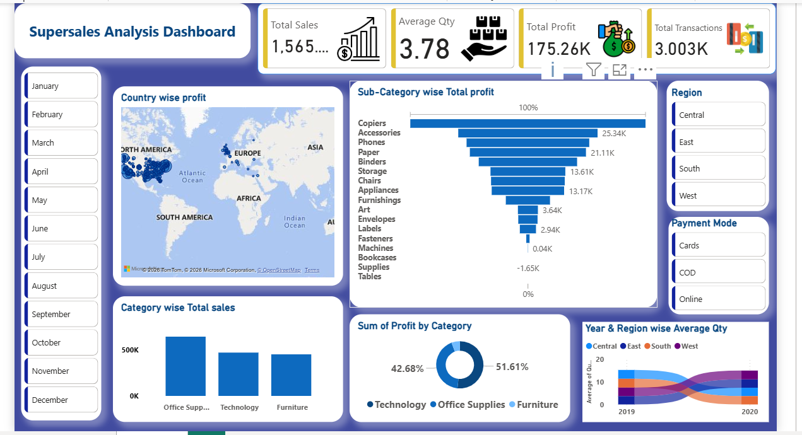

# 📊 Superstore Sales Analysis Dashboard | Power BI

## 📌 Project Overview

The **Superstore Sales Analysis Dashboard** is an interactive business intelligence project developed using Microsoft Power BI. It helps analyze sales performance, profitability, product categories, geographical profit distribution, and regional trends through KPI cards, charts, maps, and interactive filters.

This dashboard provides an overview of key business metrics to support data analysis and informed decision-making.

---

## 🎯 Project Objective

To analyze Superstore sales data, monitor key performance indicators (KPIs), compare product and regional performance, and explore profitability patterns using interactive Power BI visualizations.

---

## 🚀 Key Features

- 📈 Interactive Power BI Dashboard
- 💰 **KPI Cards**
  - Total Sales
  - Average Quantity
  - Total Profit
  - Total Transactions
- 🌎 Country-wise Profit Analysis
- 📊 Sub-Category-wise Total Profit Analysis
- 🛍️ Category-wise Total Sales Analysis
- 🍩 Profit Contribution by Category
- 📅 Year and Region-wise Average Quantity Analysis
- 🎛️ Interactive Filters and Slicers
  - Month
  - Region
  - Payment Mode
- 📌 Dynamic Visualizations Based on Filter Selections

---

## 🖼️ Dashboard Preview

### Main Dashboard



---

## 🛠️ Tools & Technologies

- Microsoft Power BI Desktop
- Power Query
- DAX (Data Analysis Expressions)
- Data Cleaning and Transformation
- Data Modeling
- KPI Development
- Interactive Slicers and Filters
- Data Visualization
- Business Intelligence

---

## 📊 Key Performance Indicators (KPIs)

| KPI | Description |
|---|---|
| Total Sales | Total sales revenue represented in the report |
| Average Quantity | Average quantity of products sold |
| Total Profit | Overall profit represented in the report |
| Total Transactions | Number of transactions represented in the report |

---

## 📈 Dashboard Analysis

The dashboard allows users to:

- Compare sales across product categories.
- Explore profit differences across product sub-categories.
- View geographical profit distribution.
- Compare average quantity across regions and years.
- Review profit contribution by category.
- Filter results by month, region, and payment mode.
- Explore how business metrics change with filter selections.

*Specific findings depend on the underlying dataset and the filters selected.*

---

## 🔄 Project Workflow

1. Import data into Power BI.
2. Clean and transform data using Power Query.
3. Prepare the data model.
4. Create required DAX measures and KPIs.
5. Develop charts and visualizations.
6. Design the dashboard layout.
7. Add interactive slicers and filters.
8. Analyze business performance metrics.

---

## 📁 Repository Structure

```text
Superstore-Sales-Analysis-PowerBI/
│
├── Dashboard.png
├── Superstore-Sales-Analysis.pbix
└── README.md
```

---

## 🎯 Skills Demonstrated

- Data Analysis
- Data Cleaning and Transformation
- Power Query
- DAX Measures
- Data Visualization
- KPI Development
- Business Intelligence
- Dashboard Development
- Profitability Analysis
- Interactive Reporting
- Business Performance Analysis

---

## 💼 Business Use Cases

- Sales Performance Monitoring
- Product Category Analysis
- Regional Profitability Analysis
- Business Performance Reporting
- Profit Contribution Analysis
- Data-Driven Decision Support

---

## 🚀 Future Enhancements

- Add year-over-year sales and profit comparisons.
- Include customer segmentation analysis.
- Develop sales forecasting and trend analysis.
- Introduce additional business performance KPIs.
- Expand customer-level and product-level insights.

---

## 👩‍💻 Author

**Deepali Sharma**

- **LinkedIn:** [Connect with me](https://www.linkedin.com/in/deepali-sharma-689731340)
- **GitHub:** [View my projects](https://github.com/sharmadeepali413-cpu)

---

## 📄 License

This project is intended for educational and portfolio purposes. Verify dataset usage permissions before redistributing the dataset or related materials.

---

⭐ If you find this project useful, feel free to star the repository!
